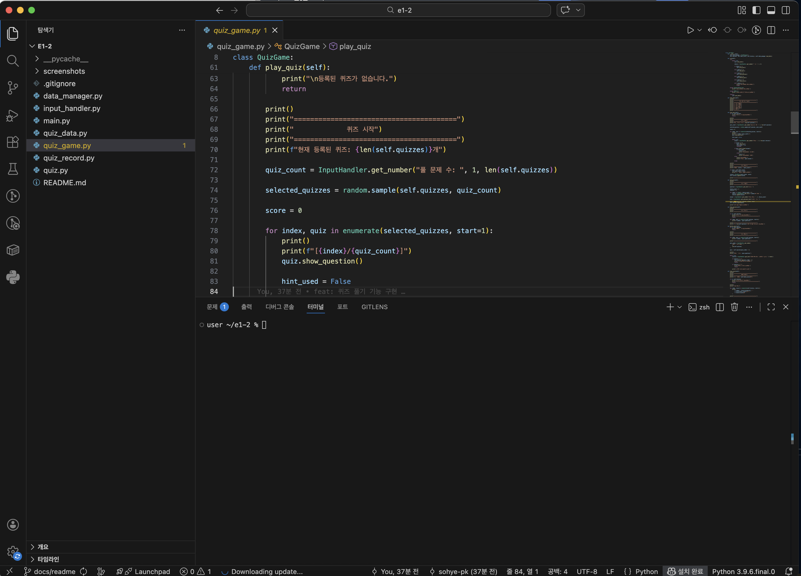
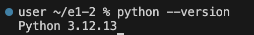
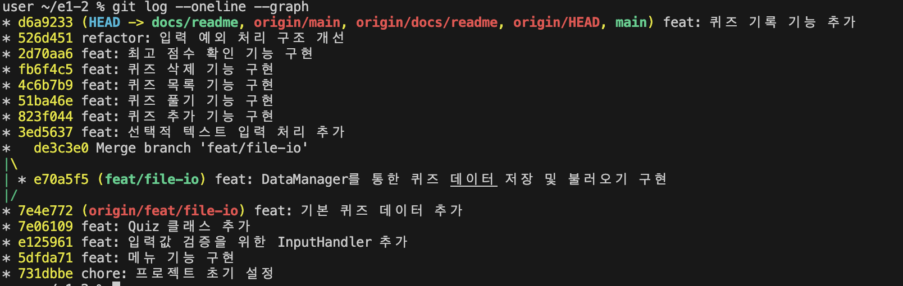
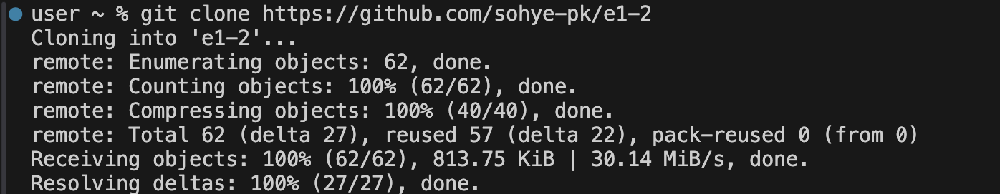
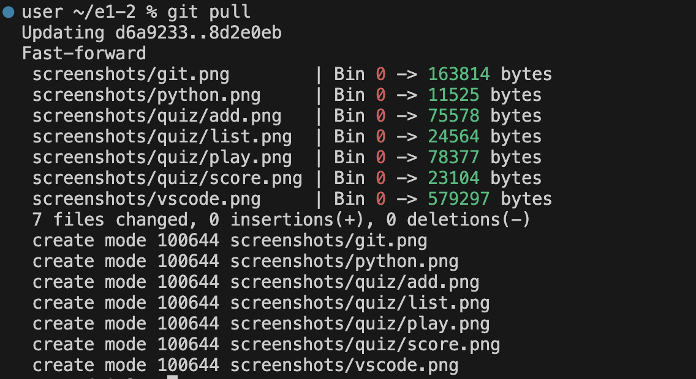
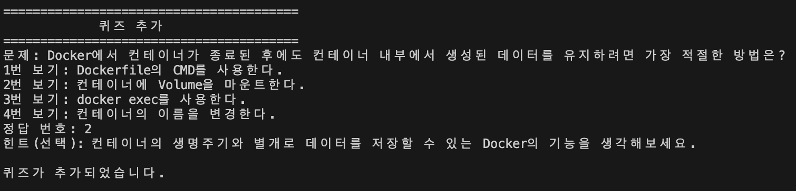
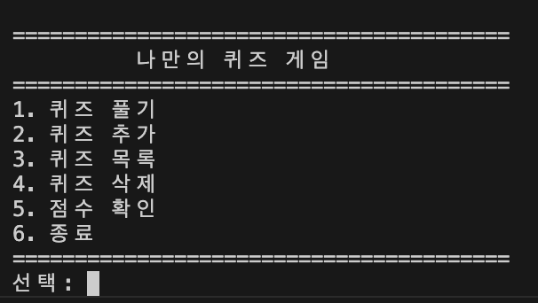
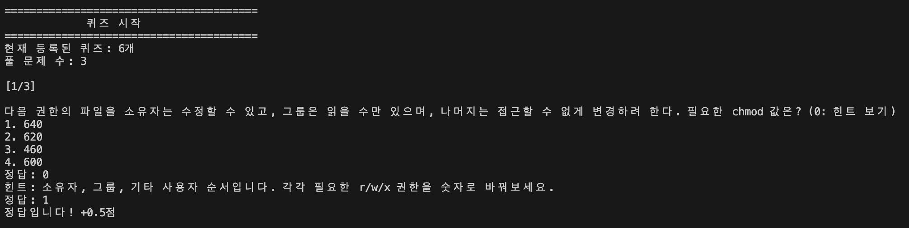
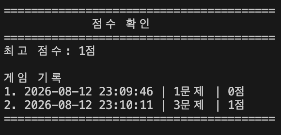

# 🎯 Terminal/Git/Docker 심화 퀴즈 게임

이 프로젝트는 파이썬을 활용하여 터미널에서 동작하는 퀴즈 게임입니다. 
단순한 문법 학습을 넘어, 객체 지향 프로그래밍(OOP)과 데이터 영속성(JSON), 그리고 Git 워크플로우를 실습하기 위해 제작되었습니다.

## 📝 프로젝트 개요
- **언어**: Python 3.10+
- **실행 환경**: Terminal
- **개발 환경**: VSCode
- **버전 관리**: Git / GitHub
- **데이터 저장**: JSON (`state.json`)
- **퀴즈 주제**: Terminal, Git, Docker

## 💡 퀴즈 주제 선정 이유
최근 학습한 **Terminal, Git, Docker**의 기본 개념을 복습하고, 더 나아가 실무에서 쓰이는 심화 개념들을 확실히 내 것으로 만들기 위해 선정했습니다. 퀴즈를 직접 구성하고 풀이하는 과정을 통해 기술적 깊이를 더하고자 합니다.

## 🚀 실행 방법
```bash
# 저장소 복제
git clone [본인의 저장소 URL]

# 프로젝트 폴더로 이동
cd [폴더명]

# 프로그램 실행
python main.py
```

---

## ✨ 주요 기능

### 1. 퀴즈 풀기

- 등록된 퀴즈 중 원하는 문제 수를 선택할 수 있습니다.
- 선택한 문제 수만큼 퀴즈가 랜덤으로 출제됩니다.
- 각 문제에 대해 힌트를 확인할 수 있습니다.
- 힌트를 사용하지 않고 정답을 맞히면 **1점**을 획득합니다.
- 힌트를 사용한 후 정답을 맞히면 **0.5점**을 획득합니다.
- 문제를 풀면서 정답 여부와 정답을 확인할 수 있습니다.

### 2. 퀴즈 추가

- 새로운 퀴즈를 직접 추가할 수 있습니다.
- 문제와 4개의 보기를 입력할 수 있습니다.
- 정답 번호를 지정할 수 있습니다.
- 힌트는 선택적으로 입력할 수 있습니다.

### 3. 퀴즈 목록

- 현재 등록된 전체 퀴즈를 확인할 수 있습니다.

### 4. 퀴즈 삭제

- 등록된 퀴즈를 선택하여 삭제할 수 있습니다.
- 삭제 전 확인 과정을 거칩니다.

### 5. 점수 및 게임 기록

- 최고 점수를 저장합니다.
- 퀴즈를 완료할 때마다 게임 기록을 저장합니다.
- 각 기록에는 다음 정보가 포함됩니다.
  - 플레이 날짜 및 시간
  - 푼 문제 수
  - 획득 점수

### 6. 데이터 저장 및 불러오기

- 퀴즈 데이터와 점수 데이터를 `state.json`에 저장합니다.
- 프로그램을 다시 실행하면 저장된 데이터를 불러옵니다.
- `state.json`이 존재하지 않거나 손상된 경우 기본 퀴즈 데이터를 사용합니다.

---

## 📋 기능 요구사항

### 퀴즈

- [x] 기본 퀴즈 데이터 제공
- [x] 5개 이상의 기본 퀴즈 제공
- [x] 원하는 문제 수 선택
- [x] 퀴즈 랜덤 출제
- [x] 정답 확인
- [x] 힌트 기능
- [x] 힌트 사용 시 0.5점 적용
- [x] 퀴즈 추가
- [x] 퀴즈 목록 확인
- [x] 퀴즈 삭제

### 점수

- [x] 최고 점수 저장
- [x] 퀴즈 플레이 기록 저장
- [x] 플레이 날짜 및 시간 저장
- [x] 푼 문제 수 저장
- [x] 획득 점수 저장

### 데이터

- [x] JSON 파일을 이용한 데이터 저장
- [x] 프로그램 실행 시 데이터 불러오기
- [x] 저장 파일이 없는 경우 기본 데이터 사용
- [x] JSON 데이터가 손상된 경우 기본 데이터 사용

### 입력 및 예외 처리

- [x] 빈 문자열 입력 처리
- [x] 숫자가 아닌 값 입력 처리
- [x] 허용 범위를 벗어난 숫자 입력 처리
- [x] `Ctrl+C` 입력 처리
- [x] `Ctrl+D` / EOF 입력 처리

---

## 🏗️ 프로젝트 구조

```text
project/
├── main.py
├── quiz_game.py
├── quiz.py
├── quiz_record.py
├── input_handler.py
├── data_manager.py
├── quiz_data.py
├── state.json
├── screenshots/
│   ├── quiz/
│   │   ├── add.png
│   │   ├── list.png
│   │   ├── play.png
│   │   └── score.png
│   ├── git.png
│   ├── python.png
│   └── vscode.png
├── .gitignore
└── README.md
```

## 📁 파일 구조

```text
project/
├── main.py
├── quiz_game.py
├── quiz.py
├── quiz_record.py
├── input_handler.py
├── data_manager.py
├── quiz_data.py
├── state.json
├── screenshots/
│   ├── quiz/
│   │   ├── add.png
│   │   ├── list.png
│   │   ├── play.png
│   │   └── score.png
│   ├── git.png
│   ├── python.png
│   └── vscode.png
├── .gitignore
└── README.md
```

| 파일 | 역할 |
|---|---|
| `main.py` | 프로그램 실행 및 `QuizGame` 실행 |
| `quiz_game.py` | 메뉴, 퀴즈 진행, 추가, 삭제, 점수 관리 등 게임의 전체 흐름 담당 |
| `quiz.py` | 개별 퀴즈의 문제, 보기, 정답, 힌트 및 정답 확인 담당 |
| `quiz_record.py` | 한 번의 퀴즈 플레이 결과(날짜/시간, 문제 수, 점수) 관리 |
| `input_handler.py` | 사용자 입력 및 입력값 검증 담당 |
| `data_manager.py` | `state.json`의 데이터 저장 및 불러오기 담당 |
| `quiz_data.py` | `state.json`이 없거나 손상된 경우 사용할 기본 퀴즈 데이터 관리 |
| `state.json` | 퀴즈, 최고 점수, 게임 기록을 저장하는 데이터 파일 |
| `.gitignore` | Git에서 제외할 파일 및 디렉터리 지정 |
| `README.md` | 프로젝트 설명 및 실행 방법, 기능, 구조 등을 문서화 |
| `screenshots/` | 개발 환경 및 프로그램 실행 결과 스크린샷 저장 |

## 💾 데이터 저장

게임 데이터는 프로젝트 루트의 state.json에 저장됩니다.

저장되는 데이터는 다음과 같습니다.
```
state.json
├── quizzes
│   ├── question
│   ├── choices
│   ├── answer
│   └── hint
│
├── best_score
│
└── history
    ├── played_at
    ├── quiz_count
    └── score
```

프로그램 시작 시 state.json을 읽어 기존 데이터를 복원하며,
파일이 없거나 정상적으로 읽을 수 없는 경우 기본 퀴즈 데이터를 사용합니다.

## 📸 스크린샷

### VSCode



### Python 버전



### Git log



### Git clone



### Git pull



### 프로그램 실행 결과

1. 퀴즈 추가



2. 퀴즈 목록



3. 퀴즈 풀기



4. 점수 및 기록

